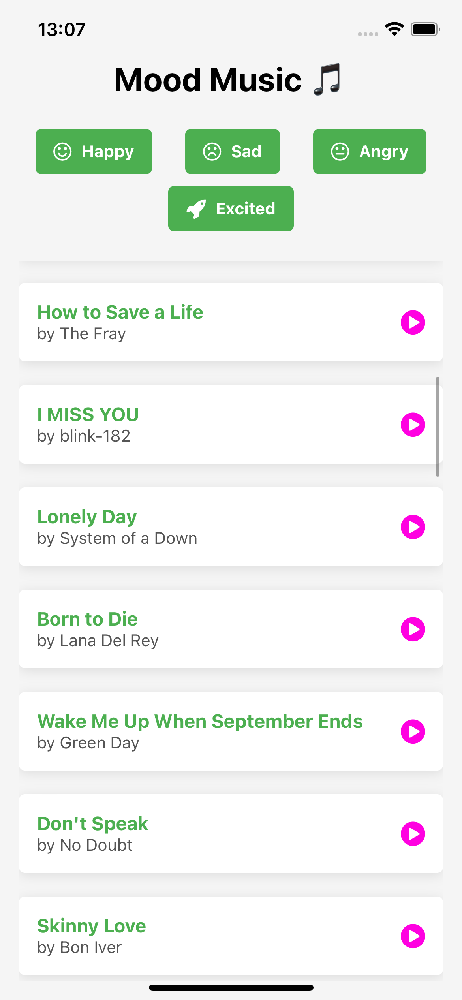

# Mood Music 🎵

Mood Music is a React Native application that uses the Last.fm API to provide music recommendations based on your mood. Select your mood, and the app will display a list of top tracks. You can also play songs directly by tapping the play icon.

## Features
- 🎧 **Mood-Based Music Recommendations:** Choose from moods like Happy, Sad, Angry, and Excited.
- 🔗 **Play Songs:** Tap the play icon next to a track to open it in your browser.
- 🎵 **Top Tracks by Mood:** Get a curated list of popular songs based on the selected mood.

## Preview
### Home Screen:

## Technologies Used
- **React Native**: Framework for building the mobile app.
- **Expo**: For easier setup and development.
- **Last.fm API**: Provides music data for tracks, artists, and albums.
- **Axios**: For API requests.
- **FontAwesome**: For icons in the app.
